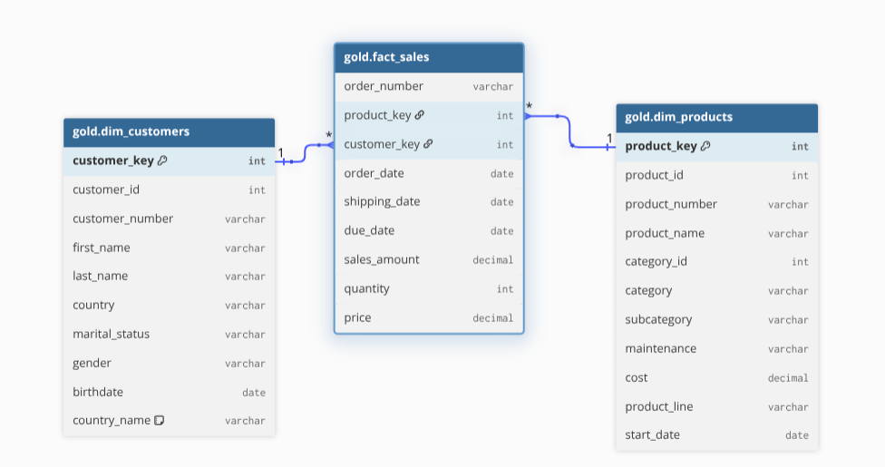

# ELT Pipeline

This project implements an end-to-end ELT data pipeline using PostgreSQL and Docker Compose. It loads raw CRM and ERP datasets into a Medallion Architecture (Bronze, Silver, Gold layers) and models the final layer as an analytics-ready **Star Schema**.

---

## 🏛️ Data Warehouse Architecture (Star Schema)

The analytical data warehouse follows a **Star Schema** architecture centered around the fact table (`gold.fact_sales`) connected to business dimensions (`gold.dim_customers` and `gold.dim_products`). This design optimizes query performance, simplifies reporting, and enables seamless business intelligence and analytics.



---

## 📁 Source File to Database Table Mapping

| Source File | Destination Table | Description | Total Rows |
| :--- | :--- | :--- | :--- |
| `datasets/source_crm/sales_details.csv` | `bronze_crm_sales_details` | Sales orders, quantities, and pricing | **60,398** |
| `datasets/source_crm/prd_info.csv` | `bronze_crm_prd_info` | Product catalog, costs, and lifecycles | **397** |
| `datasets/source_crm/cust_info.csv` | `bronze_crm_cust_info` | Customer master data | **18,494** |
| `datasets/source_erp/CUST_AZ12.csv` | `bronze_erp_cust_az12` | Customer demographics (birthdate, gender) | **18,484** |
| `datasets/source_erp/LOC_A101.csv` | `bronze_erp_loc_a101` | Customer country and locations | **18,484** |
| `datasets/source_erp/PX_CAT_G1V2.csv` | `bronze_erp_px_cat_g1v2` | Product categories and subcategories | **37** |
| **Total** | | | **98,294** |

---

## 🚀 Quick Start

### 1. Start PostgreSQL with Docker Compose
Start the PostgreSQL container in detached mode:
```bash
docker compose up -d
```

PostgreSQL will be running on port `5432` with data persisted in the `postgres_data` volume.

### 2. Truncate & Load Data

You can run either the **Bash script** or the **Python script**:

#### Option A: Bash Script (Recommended)
```bash
./bronze/load_data.sh
```
*(Or `cd bronze && ./load_data.sh`)*

#### Option B: Python Script
```bash
python3 bronze/load_data.py
```
*(To only verify current row counts without reloading, run `python3 bronze/load_data.py --check`)*

---

## ⚙️ Configuration (`.env`)

You can customize database connection parameters in `.env`:

```env
POSTGRES_USER=postgres
POSTGRES_PASSWORD=postgres
POSTGRES_DB=elt_pipeline
POSTGRES_PORT=5432
ADMINER_PORT=8080
```

---

## 🔍 Connecting to PostgreSQL

### Option 1: Via Adminer (Web UI)
Open your web browser and navigate to:
👉 **[http://localhost:8080](http://localhost:8080)**

- **System**: `PostgreSQL`
- **Server**: `postgres` (or `elt_postgres`)
- **Username**: `postgres`
- **Password**: `postgres`
- **Database**: `elt_pipeline`

### Option 2: Via Docker Compose CLI (psql):
```bash
docker compose exec -it postgres psql -U postgres -d elt_pipeline
```

### Option 3: Via External Clients (DBeaver, pgAdmin, DataGrip, VS Code):
- **Host**: `localhost` (or `127.0.0.1`)
- **Port**: `5432`
- **Database**: `elt_pipeline`
- **Username**: `postgres`
- **Password**: `postgres`

---

## 🗄️ Database Schemas (Bronze Layer)

### `bronze_crm_sales_details`
```sql
CREATE TABLE IF NOT EXISTS bronze_crm_sales_details (
    sls_ord_num    VARCHAR(50),
    sls_prd_key    VARCHAR(50),
    sls_cust_id    INT,
    sls_order_dt   INT,
    sls_ship_dt    INT,
    sls_due_dt     INT,
    sls_sales      NUMERIC(12, 2),
    sls_quantity   INT,
    sls_price      NUMERIC(12, 2)
);
```

### `bronze_crm_prd_info`
```sql
CREATE TABLE IF NOT EXISTS bronze_crm_prd_info (
    prd_id         INT,
    prd_key        VARCHAR(50),
    prd_nm         VARCHAR(100),
    prd_cost       NUMERIC(12, 2),
    prd_line       VARCHAR(10),
    prd_start_dt   DATE,
    prd_end_dt     DATE
);
```

### `bronze_crm_cust_info`
```sql
CREATE TABLE IF NOT EXISTS bronze_crm_cust_info (
    cst_id             INT,
    cst_key            VARCHAR(50),
    cst_firstname      VARCHAR(100),
    cst_lastname       VARCHAR(100),
    cst_marital_status VARCHAR(10),
    cst_gndr           VARCHAR(10),
    cst_create_date    DATE
);
```

### `bronze_erp_cust_az12`
```sql
CREATE TABLE IF NOT EXISTS bronze_erp_cust_az12 (
    cid    VARCHAR(50),
    bdate  DATE,
    gen    VARCHAR(50)
);
```

### `bronze_erp_loc_a101`
```sql
CREATE TABLE IF NOT EXISTS bronze_erp_loc_a101 (
    cid    VARCHAR(50),
    cntry  VARCHAR(100)
);
```

### `bronze_erp_px_cat_g1v2`
```sql
CREATE TABLE IF NOT EXISTS bronze_erp_px_cat_g1v2 (
    id          VARCHAR(50),
    cat         VARCHAR(100),
    subcat      VARCHAR(100),
    maintenance VARCHAR(10)
);
```

---

## 🥈 Silver Layer: Cleaned, Enriched & Relational Data

The Silver layer transforms raw data from the `bronze_*` tables into cleaned, validated, and relational `silver_*` tables without affecting the bronze layer.

### Applied Transformations:
- **Audit Columns**: Every silver table includes `dwh_created_at` storing row insertion timestamp.
- **`silver_crm_cust_info`**:
  - Deduplicated on `cst_id` retaining the row with latest `cst_create_date`.
  - Leading and trailing spaces trimmed from `cst_firstname` and `cst_lastname`.
  - `cst_gndr`: Standardized `M` -> `Male`, `F` -> `Female`, nulls -> `n/a`.
  - `cst_marital_status`: Standardized `S` -> `Single`, `M` -> `Married`, nulls -> `n/a`.
- **`silver_crm_prd_info`**:
  - `cat_id`: First 5 characters of `prd_key` with hyphens replaced by underscores (e.g. `CO_RF`).
  - `prd_key`: Extracted product identifier with hyphens replaced by underscores (e.g. `FR_R92B_58`).
  - `prd_line`: Standardized `R` -> `Road`, `M` -> `Mountain`, `S` -> `Other Sales`, `T` -> `Touring`, nulls -> `n/a`.
  - Deduplicated to latest record per `prd_key` to support relational integrity.
- **`silver_crm_sales_details`**:
  - `sls_prd_key`: Hyphens replaced by underscores to match `silver_crm_prd_info.prd_key`.
  - `sls_order_dt`, `sls_ship_dt`, `sls_due_dt`: Set to `NULL` if `0` or length `< 8`, otherwise converted into `DATE`.
  - `sls_price`: Negative values converted to positive (`ABS`). Derived as `sls_sales / sls_quantity` if `0` or `NULL`.
  - `sls_sales`: Derived as `sls_quantity * sls_price` if `<= 0` or `NULL`.
- **`silver_erp_cust_az12`**:
  - `cid`: Removed `NAS` prefix to align with customer master key `cst_key`.
  - `bdate`: Future birthdates (`> CURRENT_DATE`) converted to `NULL`.
  - `gen`: Standardized `M` -> `Male`, `F` -> `Female`, others -> `NULL`.
- **`silver_erp_loc_a101`**:
  - `cid`: Removed hyphens (e.g. `AW-00011000` -> `AW00011000`) to align with customer master key `cst_key`.
  - `cntry`: Standardized country codes (`DE` -> `Germany`, `US`/`USA` -> `United States`, blanks -> `n/a`).

### Relational Constraints:
- `silver_crm_sales_details.sls_prd_key` ➔ **`FOREIGN KEY`** ➔ `silver_crm_prd_info.prd_key`
- `silver_erp_cust_az12.cid` ➔ **`FOREIGN KEY`** ➔ `silver_crm_cust_info.cst_key`
- `silver_erp_loc_a101.cid` ➔ **`FOREIGN KEY`** ➔ `silver_crm_cust_info.cst_key`

### How to Run Silver Layer:
```bash
# Option A: Bash Script
./silver/load_silver.sh

# Option B: Python Script
python3 silver/load_silver.py
```

---

## 🥇 Gold Layer: Dimensional Model (Star Schema)

The Gold layer exposes business-ready dimensional views in schema `gold` for direct reporting and analytics.

### Views Created:
- **`gold.dim_customers`**:
  - Joins customer master (`silver.crm_cust_info`), demographics (`silver.erp_cust_az12`), and locations (`silver.erp_loc_a101`).
  - Generates surrogate key `customer_key` (`ROW_NUMBER() OVER (ORDER BY cst_id)`).
  - Implements gender prioritization (CRM primary, ERP fallback).
- **`gold.dim_products`**:
  - Joins product catalog (`silver.crm_prd_info`) with product categories (`silver.erp_px_cat_g1v2`).
  - Filters rows where `prd_end_dt IS NULL` to represent active current products.
  - Generates surrogate key `product_key` (`ROW_NUMBER() OVER (ORDER BY prd_start_dt, prd_key)`).
  - Exposes category, subcategory, cost, line, and start date.
- **`gold.fact_sales`**:
  - Connects sales transactions (`silver.crm_sales_details`) to `gold.dim_products` and `gold.dim_customers`.
  - Replaces operational IDs with dimensional surrogate keys `product_key` and `customer_key`.

### How to Run Gold Layer:
```bash
# Option A: Bash Script
./gold/load_gold.sh

# Option B: Python Script
python3 gold/load_gold.py
```

---

## 📦 Directory Structure

```
elt_pipeline/
├── bronze/
│   ├── 01_create_tables.sql       # Bronze DDL: Raw table creation
│   ├── 02_truncate_and_load.sql   # SQL Truncate & Bulk COPY script
│   ├── load_data.sh               # Executable bash loader
│   └── load_data.py               # Executable python loader
├── silver/
│   ├── 01_create_tables.sql       # Silver DDL: Tables with FKs & dwh_created_at
│   ├── 02_transform_and_load.sql  # SQL Transformation & Enrichment script
│   ├── load_silver.sh             # Executable bash loader for Silver
│   └── load_silver.py             # Executable python loader for Silver
├── gold/
│   ├── 01_create_gold_views.sql   # Gold DDL: Star Schema dimensional views
│   ├── load_gold.sh               # Executable bash loader for Gold views
│   └── load_gold.py               # Executable python loader for Gold views
├── datasets/
│   ├── source_crm/
│   └── source_erp/
├── docker-compose.yml             # PostgreSQL 16 & Adminer services
├── .env                           # Credentials & port configuration
├── .env.example
└── README.md
```
